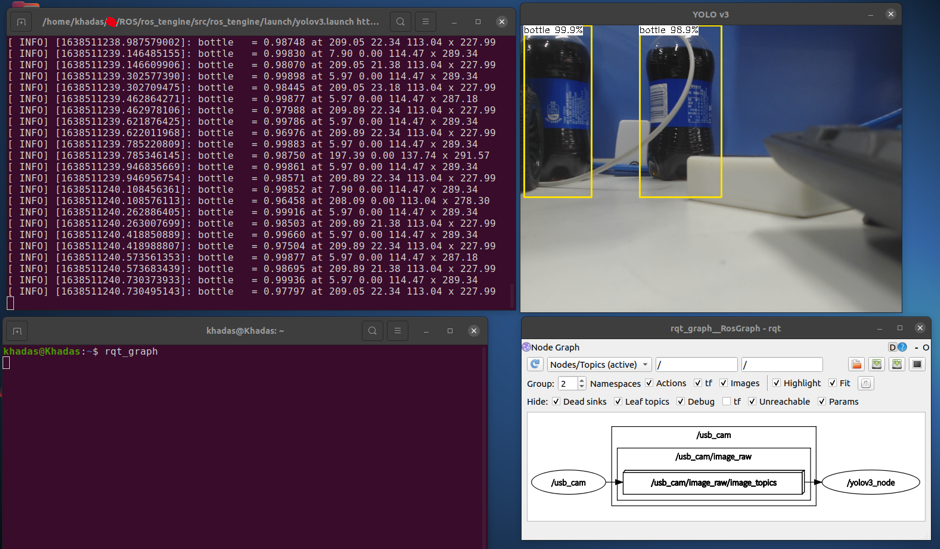

# ROS_Tengine_NPU #

This is a ROS package for [Tengine](https://github.com/OAID/Tengine/blob/tengine-lite/), a high-performance neural network inference framework  by **[OPEN AI LAB](http://www.openailab.com)** optimized for embedded devices:

- ARM NEON assembly level optimization
- Sophisticated memory management and data structure design, very low memory footprint
- Completely separated front-end/back-end design, Supports CPU, GPU, NPU and other heterogeneous computing units
- Extensible model design, supports uint8/int8 quantization storage
- Can import caffe/pytorch/mxnet/onnx/ncnn models

## Setting up ##
* Khadas VIM3 device
* USB Camera
* [Tengine Compile with TIM-VX ](https://tengine-docs.readthedocs.io/zh_CN/latest/source_compile/compile_timvx.html)
### Library ###

## ROS package ##
```bash
git clone https://github.com/mlbo/ros_tengine.git
cd ros_tengine
git submodule update --init
```
```bash
├── Catkin_make.sh
├── Clean.sh
├── Run.sh
└── src
    ├── ros_tengine
    │   ├── assets
    │   │   └── models
    │   │       └── yolov3_uint8.tmfile
    │   ├── CMakeLists.txt
    │   ├── include
    │   │   └── ros_tengine
    │   │       ├── c_api.h
    │   │       ├── defines.h
    │   │       ├── timer.hpp
    │   │       ├── timvx_device.h
    │   │       ├── types.hpp
    │   │       ├── yolo.hpp
    │   │       └── yolo_layer.hpp
    │   ├── launch
    │   │   └── yolov3.launch
    │   ├── lib
    │   │   └── libtengine-lite.so
    │   ├── msg
    │   │   ├── Euler.msg
    │   │   ├── FaceObject.msg
    │   │   ├── Object.msg
    │   │   ├── Rectangle.msg
    │   │   └── Vector2D.msg
    │   ├── package.xml
    │   └── src
    │       ├── timer.cc
    │       ├── yolo.cpp
    │       ├── yolo_layer.cpp
    │       └── yolov3_node.cpp
    └── usb_cam
```
#### General launch parameters ####
```xml
<!-- Usb Camera -->
    <node name="usb_cam" pkg="usb_cam" type="usb_cam_node" output="screen" >
        <param name="video_device" value="/dev/video0" />
        <param name="image_width" value="640" />
        <param name="image_height" value="480" />
        <param name="pixel_format" value="yuyv" />
        <param name="camera_frame_id" value="usb_cam" />
        <param name="io_method" value="mmap"/>
    </node>
<!-- Dispaly detect result true or false-->
    <arg name="display_output" default="false"/>
    <arg name="camera_topic" default="/usb_cam/image_raw"/>
    <node name="yolov3_node" pkg="ros_tengine" type="yolov3_node" output="screen">
      <param name="model_file" value="yolov3_uint8.tmfile"/>
      <param name="display_output" value="$(arg display_output)"/>
      <remap from="/usb_cam/image_raw" to="$(arg camera_topic)"/>
      <param name="probability_threshold" value="0.5"/>
    </node>
```
## How to build ##
```bash
bash Catkin_make.sh
```
## How to run ##
```bash
bash Run.sh
```
## Result ##


## :v:  Acknowledgements ##
[Tengine](https://github.com/OAID/Tengine/blob/tengine-lite/)

[ros_ncnn](https://github.com/nilseuropa/ros_ncnn)

[Insightface-NPU](https://github.com/mlbo/Insightface-NPU)
